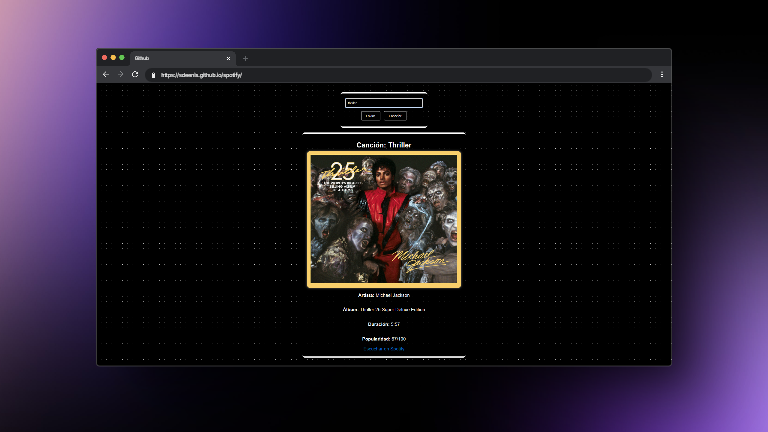
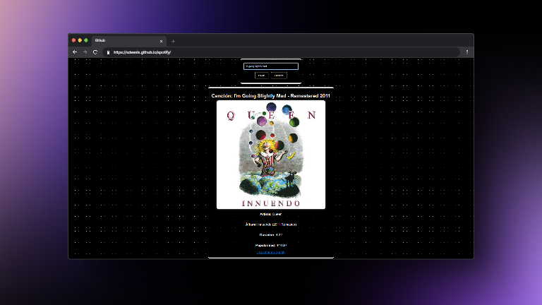

# Spotify Data Viewer 🎵

Este es un proyecto que utiliza la **API de Spotify** para obtener y mostrar información sobre canciones. Está desarrollado con **jQuery** y se encuentra desplegado en: [https://sdeenis.github.io/spotify/](https://sdeenis.github.io/spotify/).

## Características

- 🔍 **Búsqueda de canciones, artistas y álbumes**: Introduce el nombre de una canción o artista para obtener información detallada.
- 🎶 **Datos en tiempo real**: Los datos se obtienen directamente desde la API de Spotify.

## Tecnologías utilizadas

- **jQuery**: Para realizar las peticiones a la API y gestionar la manipulación del DOM.
- **HTML y CSS**: Para la estructura y estilo básico de la aplicación.
- **Spotify API**: Para obtener información sobre canciones, artistas y álbumes.

## Vista previa

